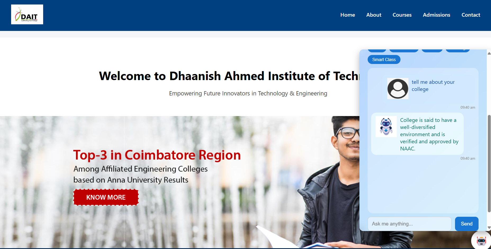

# 🤖 Tulasi – AI Chatbot for Dhaanish Ahmed Institute of Technology

A smart virtual assistant designed to answer real-world college-related queries such as admissions, courses, fees, hostel, placements, and more! EduBot combines semantic search with an LLM (FLAN-T5) to give fast, relevant, and intelligent responses.



---

## 🚀 Features

- ✅ **Semantic FAQ Matching** using Sentence Transformers
- ✅ **LLM-based Response Fallback** with FLAN-T5
- ✅ **Dynamic Chatbot UI** with floating toggle and college-style design
- ✅ **Dark/Light Mode Toggle**
- ✅ **Bot/User Avatar Customization**
- ✅ **Cloned College Website Interface**

---

## 🧠 How It Works

1. The user types a question in the chatbot UI.
2. The backend checks for semantic similarity using `sentence-transformers`.
3. If a high-match FAQ is found → return answer.
4. If not → fallback to LLM (FLAN-T5) for generating a relevant response.
5. All replies are displayed live inside a beautiful, responsive UI.

---

## 🛠️ Tech Stack

| Layer       | Technology                         |
|-------------|------------------------------------|
| Frontend    | HTML, CSS, JavaScript              |
| Backend     | Python, Flask                      |
| AI Models   | SentenceTransformer, FLAN-T5       |
| Deployment  | Localhost / GitHub (Free Tier Ready) |
| Design      | Custom HTML/CSS + Floating Toggle |

---

## 📦 Installation

```bash
git clone https://github.com/Arul123457/AI_College_Chatbot.git
cd AI_College_Chatbot
pip install -r requirements.txt
python app.py
